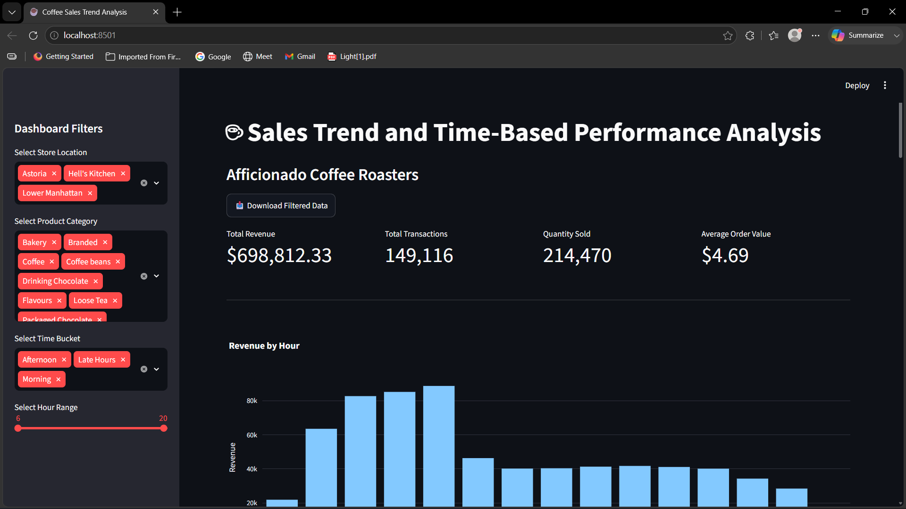
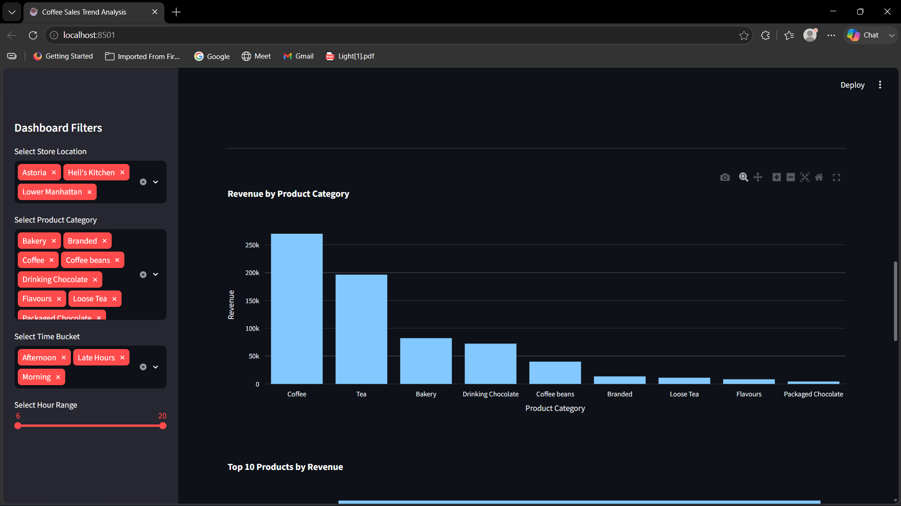
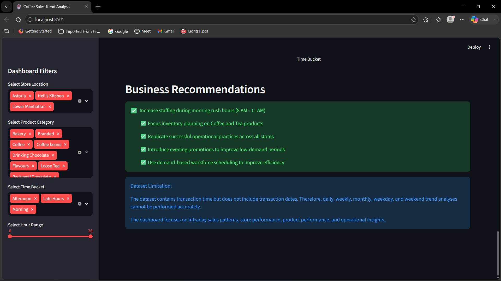

# Coffee Sales Trend Analysis

Interactive Business Intelligence Dashboard built using Python, Pandas, Plotly and Streamlit.

## Project Objective

Analyze coffee shop sales performance to identify:

- Revenue trends
- Store performance
- Product performance
- Customer purchasing behavior
- Operational business insights

---

## Technologies Used

- Python
- Pandas
- Plotly
- Streamlit
- Git & GitHub

---

## Dataset Features

- Transaction Quantity
- Product Category
- Product Type
- Store Location
- Transaction Time
- Revenue

---

## Key Business Insights

### Morning Rush Drives Revenue

Peak sales occur between 8 AM and 10 AM.

### Coffee and Tea Dominate Revenue

These categories contribute the majority of total sales.

### Store Performance is Consistent

All three store locations perform similarly.

### Evening Demand is Lower

Revenue decreases significantly after 6 PM.

---

## Dashboard Features

- Interactive Store Filters
- Product Category Filters
- Time Bucket Filters
- Hour Range Filters
- Download Filtered Data
- Business Recommendations Section

---

## Dashboard Screenshots

### Overview

### Product Analysis

### Recommendations

---

## Business Recommendations

- Increase staffing during morning rush hours
- Focus inventory planning on Coffee and Tea products
- Introduce evening promotions
- Use demand-based workforce scheduling

---

## Author

Anushka Das